# Distributed Logging System & Observability Pipeline

A complete, production-style Distributed Logging System (DLS) built in Python for academic final evaluation. The system simulates microservice transaction logs, collects them with a custom agent, buffers them in Kafka, indexes them in OpenSearch for full-text queries, saves metadata in PostgreSQL, and automatically archives cold data to MinIO S3 storage. Prometheus and Grafana provide real-time metrics and visualization.

---

## Problem Statement

In modern distributed microservice architectures, applications are partitioned into independent, decoupled services that communicate over network boundaries. This architectural pattern introduces significant operational challenges:

1. **Log Fragmentation**: Logs are scattered across multiple hosts, containers, and directories. Engineers cannot search across service boundaries during an outage.
2. **Lack of Request Correlation**: Without a unified request and trace correlation mechanism, tracing a single transaction (e.g., a customer checkout failing) across a chain of services (frontend $\rightarrow$ auth $\rightarrow$ payment $\rightarrow$ inventory) is impossible.
3. **Storage Cost Imbalance**: Storing raw text logs in expensive, hot indexing engines indefinitely is financially unsustainable. However, deleting logs too early breaks compliance and historical debugging.
4. **Delayed Incident Detection**: Without centralized log parsing, alerting on error thresholds or system anomalies happens reactively after customers report outages.

---

## Proposed Solution

This project implements an end-to-end observability and log delivery pipeline designed to resolve the issues of distributed visibility:

* **Log Collection & Enrichment**: A lightweight tailing agent (`agent.py`) follows service logs, enriches them with request and trace correlation IDs, and batches them to a gateway API.
* **Decoupled Buffer Ingestion**: A high-throughput FastAPI gateway (`main.py`) validates log payloads and streams them into Apache Kafka. This decouples the ingestion layer from database write speeds.
* **Hybrid Storage Architecture**:
  * **Hot Storage (OpenSearch)**: The Kafka consumer worker indexes raw JSON records into daily OpenSearch indices for sub-second search and lucene queries.
  * **Relational Indexing (PostgreSQL)**: The worker indexes structured log metadata in PostgreSQL to track transactional metrics, alert rules, and trace correlation graphs.
  * **Cold Storage (MinIO S3)**: A periodic retention manager archives older logs as compressed JSON records in S3 buckets and purges expired entries from OpenSearch and PostgreSQL.
* **Observability & Real-Time Alerting**: Prometheus scrapes metrics from the API and worker. Grafana visualizes log rates and queue lag. Prometheus Alertmanager dispatches alerts to a mock webhook endpoint when error thresholds are exceeded.

### Solution Tradeoffs
* **KRaft vs Zookeeper**: We configured Kafka in KRaft mode to eliminate Zookeeper dependency, reducing memory footprint and setup complexity.
* **Hybrid Database vs Unified Store**: Storing metadata in PostgreSQL while keeping raw documents in OpenSearch allows us to run standard relational SQL queries for alerts and analytics, avoiding heavy search queries on OpenSearch.
* **Python ASGI vs compiled binary**: We chose FastAPI (Python ASGI) for the ingestion API. Although a Go or Rust daemon would be faster for raw throughput, Python allows rapid development, a rich integration ecosystem, and conforms to academic evaluations.

---

## Technology Stack

The Distributed Logging System uses the following technologies:
* **Core Language**: Python 3.11+
* **Ingestion Gateway**: FastAPI, Uvicorn (ASGI web server)
* **Message Queue / Buffer**: Apache Kafka (KRaft mode)
* **Hot Indexing Engine**: OpenSearch (Elasticsearch-compatible search engine)
* **Cold Storage / Archive**: MinIO (S3-compatible object storage)
* **Relational DB / Metadata Store**: PostgreSQL 15
* **Metrics Collector**: Prometheus Server
* **Alert Delivery**: Alertmanager (Prometheus Alert Routing)
* **Data Visualizer**: Grafana Dashboard UI
* **Python Libraries**: `fastapi`, `uvicorn`, `kafka-python-ng`, `psycopg2-binary`, `opensearch-py`, `boto3`, `prometheus-client`, `reportlab`, `requests`, `pillow`

---

## System Architecture

The logging system is split into three main flows: Ingestion, Processing/Indexing, and Archival/Alerting.

### 1. High-Level Design (HLD) Architecture Diagram
Shows the end-to-end data flow from application generation to visualizers and archives:

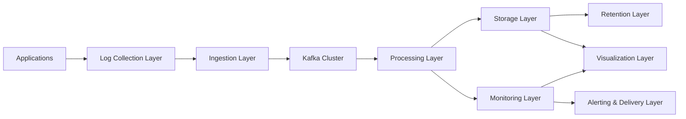

### 2. Low-Level Design (LLD) Pipeline Diagram
Illustrates the detailed pipeline components, offset tracking, load balancers, rate limiters, consumers, storage, monitoring, alerting, visualizers, and retention:

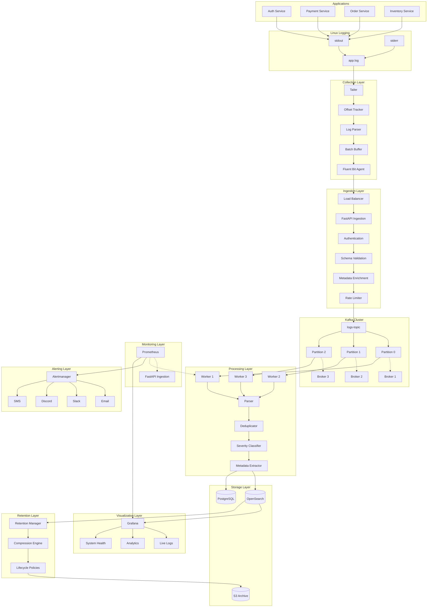

### 3. Log Processing Sequence Diagram
Traces a log entry from application write to consumer indexing and alert dispatching:

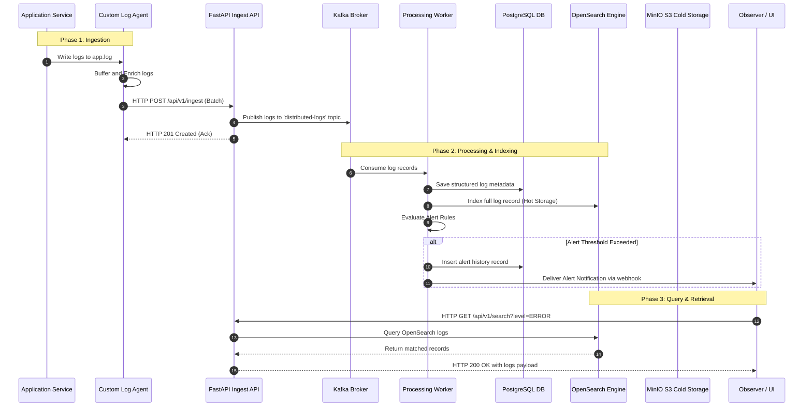

### 4. System Deployment Network Diagram
Represents the container layout and physical port bridges within the Docker Host:

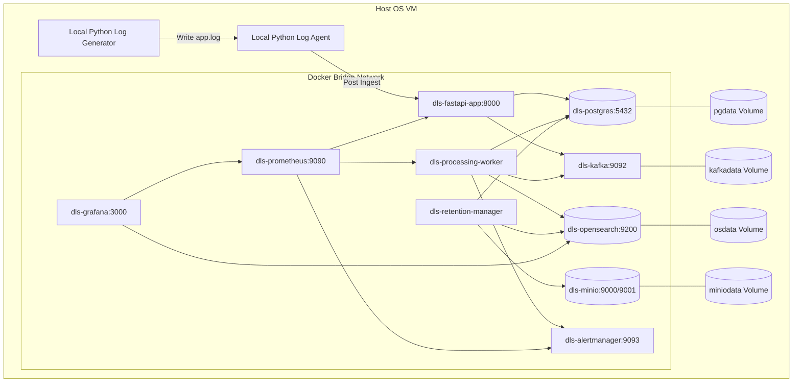

### 5. Retention & Alerting Workflow Diagram
Explains database cleanup, cold storage serialization, and Alertmanager routing:

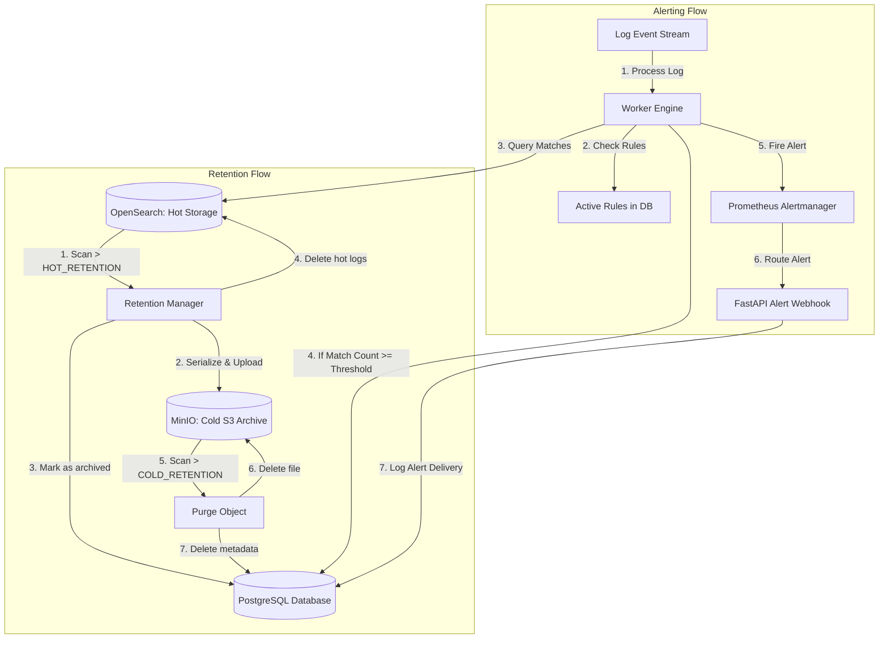

### 6. Observability Stack Diagram
Shows how metrics are scraped, evaluated, and displayed in real-time dashboards:

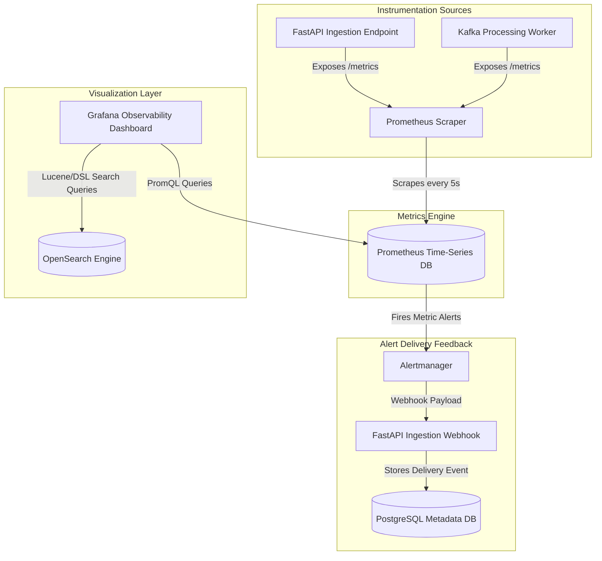

---

## Module Description

All executable code lies in the [source/](file:///Users/saurabhyadav/Desktop/Distributed-Logging-System/source/) folder:

1. **[config.py](file:///Users/saurabhyadav/Desktop/Distributed-Logging-System/source/config.py)**: Centralizes configuration mapping (DB credentials, host addresses, S3 endpoints, retention configurations) loaded dynamically from the `.env` file using Pydantic.
2. **[db.py](file:///Users/saurabhyadav/Desktop/Distributed-Logging-System/source/db.py)**: Handles database connections to PostgreSQL. Initializes schema tables and manages log metadata writes, alert rules creation, and historical logs tracking.
3. **[opensearch_client.py](file:///Users/saurabhyadav/Desktop/Distributed-Logging-System/source/opensearch_client.py)**: Manages OpenSearch API connections. Installs default daily log mappings template, indexes documents, implements Lucene text and exact term query search APIs, and performs log cleanups.
4. **[s3_client.py](file:///Users/saurabhyadav/Desktop/Distributed-Logging-System/source/s3_client.py)**: Boto3 client wrapper for MinIO, verifying bucket existence and saving gzip-compressed JSON log logs in S3 block storage.
5. **[kafka_client.py](file:///Users/saurabhyadav/Desktop/Distributed-Logging-System/source/kafka_client.py)**: Establishes Kafka Producer and Consumer endpoints. Includes a local, in-memory queue fallback if the Kafka cluster goes offline to avoid log loss.
6. **[main.py](file:///Users/saurabhyadav/Desktop/Distributed-Logging-System/source/main.py)**: The FastAPI server exposing `/api/v1/ingest` (high throughput streams) and `/api/v1/search` (multi-field Lucene engine), alongside alert management configurations, `/metrics` scrapers, and Alertmanager callback webhook.
7. **[worker.py](file:///Users/saurabhyadav/Desktop/Distributed-Logging-System/source/worker.py)**: Kafka Consumer daemon that processes consumed messages, writes metadata to Postgres, indexes full logs to OpenSearch, and fires Alertmanager triggers when log counts exceed limits.
8. **[retention.py](file:///Users/saurabhyadav/Desktop/Distributed-Logging-System/source/retention.py)**: Cold archival cron job. Moves OpenSearch logs past `HOT_RETENTION_MINUTES` to S3 buckets, marks records as archived in Postgres, and purges S3 files past `COLD_RETENTION_MINUTES`.
9. **[agent.py](file:///Users/saurabhyadav/Desktop/Distributed-Logging-System/source/agent.py)**: Lightweight tailing agent that parses local logs, enriches missing trace IDs, batches events, and POSTs them to the FastAPI ingestion gateway.
10. **[log_generator.py](file:///Users/saurabhyadav/Desktop/Distributed-Logging-System/source/log_generator.py)**: Simulated application engine. Emits correlated transactional log lines representing checkout states across microservices to `logs/app.log`.

---

## Database Design

### Database ER Diagram
The PostgreSQL relational schema handles structured transaction logs metadata indexation, alerting configurations, and history tracking:

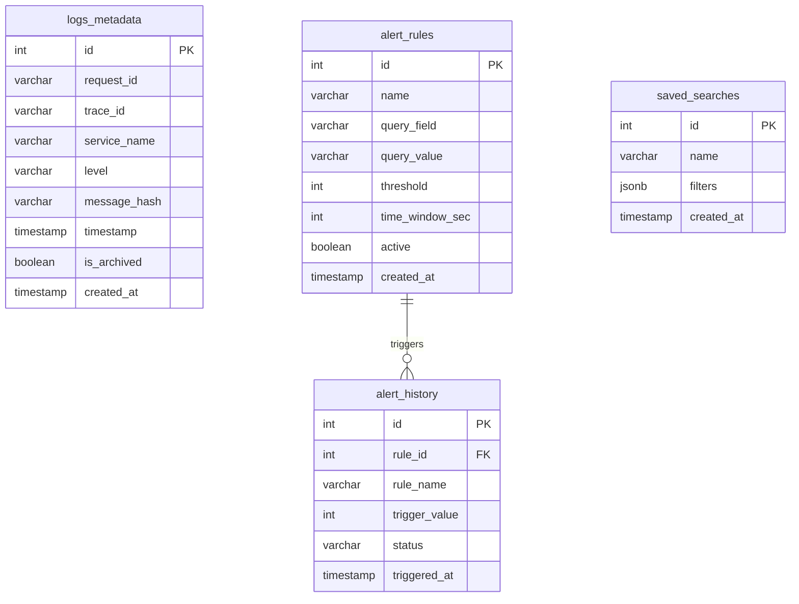

### Schema Details
* **`logs_metadata`**: Stores metadata of ingested logs. `request_id` and `trace_id` are indexed to enable fast lookup of transaction traces. `message_hash` tracks duplicated logs.
* **`alert_rules`**: Stores alert configurations (e.g. "Trigger alert if level=ERROR exceeds 5 matches in 60 seconds").
* **`alert_history`**: Tracks triggered alerting events, referencing the rule that fired them.
* **`saved_searches`**: Stores saved filters and search queries in JSONB format.

---

## Project Overview

The workspace layout is structured as follows:
```
Distributed-Logging-System/
├── .env                              # Local environment configurations (Active)
├── .env.example                      # Reference template for configuration setup
├── requirements.txt                  # Python dependencies
├── README.md                         # Project documentation
├── docker-compose.yml                # Docker compose orchestration file
├── alertmanager/
│   └── alertmanager.yml              # Alertmanager routing rules configuration
├── prometheus/
│   └── prometheus.yml                # Prometheus scraping jobs configuration
├── grafana/
│   └── provisioning/
│       ├── datasources/
│       │   └── datasources.yml       # Automated datasources configuration (Prometheus)
│       └── dashboards/
│           ├── dashboards.yml        # Provisioning directory provider
│           └── dashboard.json        # Pre-configured metrics dashboard panels
├── diagrams/                         # Markdown diagram files (.md)
├── docs/
│   └── screenshots/                  # Mockup images used for documentation reference
├── source/                           # Python microservice code files
├── scripts/
│   ├── setup.sh                      # Virtual environment setup script
│   └── run.sh                        # Pipeline process launch script
└── logs/                             # Log directory for background runs (gitignored)
```

---

## Setup Instructions

### Prerequisites
* Install **Docker Desktop** (version 20.10+ recommended)
* Install **Python 3.11+**

### Step-by-Step Installation
1. Navigate to the project root directory:
   ```bash
   cd Distributed-Logging-System
   ```
2. Copy the example environment file:
   ```bash
   cp .env.example .env
   ```
3. Initialize the Python virtual environment, upgrade pip, and install all required libraries using the setup helper:
   ```bash
   chmod +x scripts/setup.sh
   ./scripts/setup.sh
   ```

---

## Dependencies

The project uses the following Python packages defined in `requirements.txt`:
* **`fastapi` & `uvicorn`**: High-performance, async framework to handle HTTP ingestion and Lucene searches.
* **`kafka-python-ng`**: Maintained fork of kafka-python to interface with Kafka brokers under modern Python runtimes.
* **`psycopg2-binary`**: PostgreSQL client for metadata storage.
* **`opensearch-py`**: Python client for OpenSearch document indexing.
* **`boto3`**: AWS SDK utilized to write archived logs to MinIO S3 cold storage.
* **`prometheus-client`**: Instrumentation library to expose application metrics at `/metrics`.
* **`reportlab` & `pillow`**: Layout engines to compile visual reports with embedded screenshots.
* **`requests`**: Handles REST callbacks (e.g. worker alerting webhooks).

---

## Execution Steps

### 1. Spin Up Docker Stack
Start PostgreSQL, Kafka, OpenSearch, MinIO, Prometheus, Alertmanager, and Grafana in the background:
```bash
docker compose up -d
```
Verify all containers are healthy:
```bash
docker compose ps
```

### 2. Run the Ingestion & Processing Pipeline
Start the background Python services (FastAPI, Worker, Agent, Generator, Retention Manager):
```bash
chmod +x scripts/run.sh
./scripts/run.sh
```
*Note: Press `Ctrl+C` in this terminal to stop all Python processes safely.*

### 3. Verify System Operations
* **Swagger API Docs**: Open [http://localhost:8000/docs](http://localhost:8000/docs) in your browser.
* **Query Logs**: Run a search query using curl:
  ```bash
  curl -s "http://localhost:8000/api/v1/search?level=ERROR&limit=2" | json_pp
  ```
* **Verify Metrics**: Query the Prometheus endpoint:
  ```bash
  curl -s "http://localhost:8000/metrics" | grep logs_ingested_total
  ```
* **Grafana Dashboard**: Go to [http://localhost:3000](http://localhost:3000) (User/Pass: `admin`/`admin`). Open the **Distributed Logging System Metrics** dashboard in the **Observability** folder to view live ingestion rates and queue lag.

---

## Implementation Details

### Trace request correlation
The Simulated Log Generator (`log_generator.py`) generates a unique `request_id` and `trace_id` (UUIDv4) at the start of a transaction. As the transaction executes across different microservices, the IDs are appended to the log lines.
The custom log agent (`agent.py`) parses these logs and sends them to the API. The search API can then query all logs matching a specific `request_id` to trace the transaction's path:
```bash
curl -s "http://localhost:8000/api/v1/search?request_id=<REQUEST_UUID>"
```

### Dynamic Daily Indexing
The Log Processing Worker (`worker.py`) extracts the ISO-8601 timestamp from the log payload and dynamically generates the OpenSearch index name (e.g., `logs-2026.06.15`). This ensures that logs are structured by day, making index-level retention and purging clean and fast.

### Webhook Delivery Feedback
When a worker alert triggers (e.g. CPU or Error limits exceeded), it sends an alert payload to Prometheus Alertmanager. Alertmanager routes the alert back to the FastAPI endpoint `/api/v1/alerts/webhook` as a webhook. The API logs the webhook event, creating an audit loop stored in PostgreSQL.

---

## Additional Project Details

### Tradeoff Analysis
* **KRaft Mode over ZooKeeper**: KRaft mode simplifies container orchestration by removing the need for a separate ZooKeeper cluster, reducing resources and networking issues.
* **PostgreSQL for Metadata Indexing**: We index log metadata in PostgreSQL rather than keeping everything in OpenSearch. This allows us to run fast relational queries for alerting rules and saved searches, leaving OpenSearch to handle large text searches.
* **FastAPI vs Go**: We used FastAPI for the ingestion API. While Go would offer higher raw throughput, FastAPI allowed us to build the ingestion gateway, search API, and Alertmanager webhook in a single Python script.

### Local Port Maps & Credentials

| Service | Port | Console URL | Credentials | Description |
| :--- | :--- | :--- | :--- | :--- |
| **FastAPI App** | `8000` | [http://localhost:8000/docs](http://localhost:8000/docs) | *None* | Ingestion gateway & Search Swagger UI |
| **Grafana** | `3000` | [http://localhost:3000](http://localhost:3000) | `admin` / `admin` | Observability metrics dashboard |
| **Prometheus** | `9090` | [http://localhost:9090](http://localhost:9090) | *None* | Time-series query dashboard |
| **Alertmanager** | `9093` | [http://localhost:9093](http://localhost:9093) | *None* | Triggered alerts console |
| **MinIO S3 Console** | `9001` | [http://localhost:9001](http://localhost:9001) | `minioadmin` / `minioadmin` | Cold storage bucket browser |
| **OpenSearch** | `9200` | [http://localhost:9200](http://localhost:9200) | *None (Security disabled)* | Hot storage search node |
| **PostgreSQL** | `5432` | `localhost:5432` | `postgres` / `postgres` | Metadata storage database |

---

## Screenshots

### Grafana Observability Dashboard
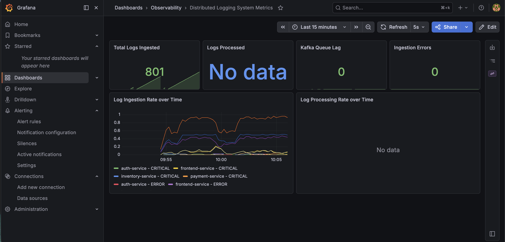
*Figure 1: Grafana metrics dashboard showing real-time log ingestion and processing telemetry.*

### Prometheus Targets Health Console
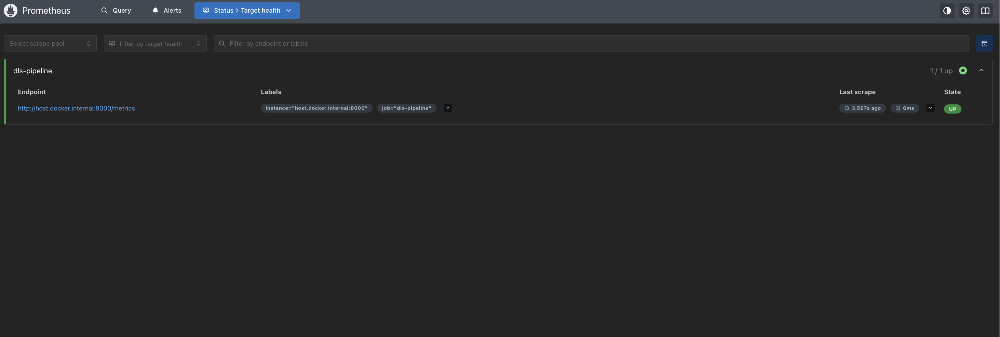
*Figure 2: Prometheus active targets showing the Python FastAPI metrics endpoint in UP state.*

### MinIO Cold Storage Bucket Console
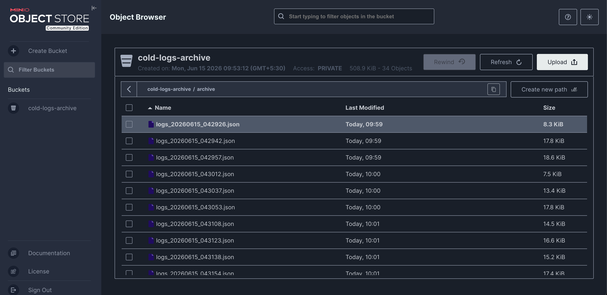
*Figure 3: MinIO S3 Object Browser showing archived cold log chunks stored as compressed JSON files.*

### Prometheus Metrics Query (Graph)
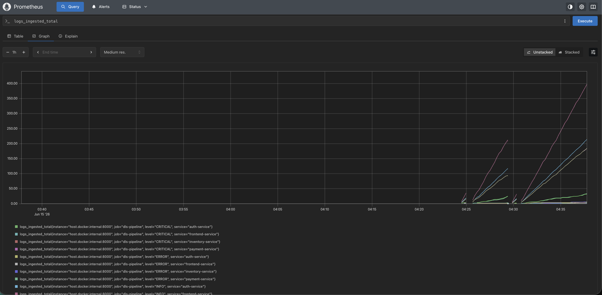
*Figure 4: Prometheus dashboard graphing logs_ingested_total rising over time.*

### Prometheus Metrics Query (Table)
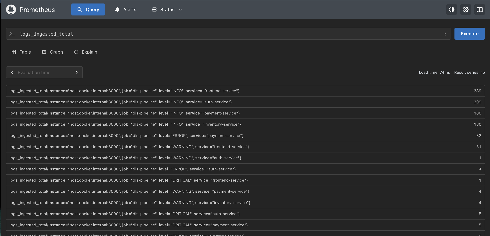
*Figure 5: Prometheus console querying the logs_ingested_total metric across multiple services.*

### FastAPI Search API Response JSON
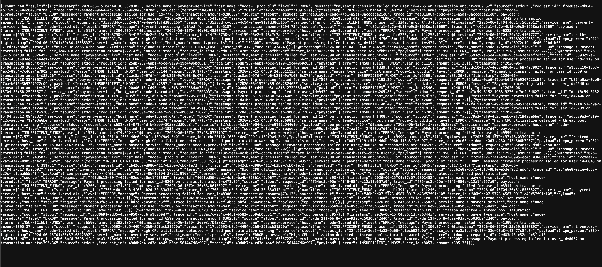
*Figure 6: API search response returning JSON metadata records filtered by service or level.*

### Prometheus Metrics Raw Endpoint Output
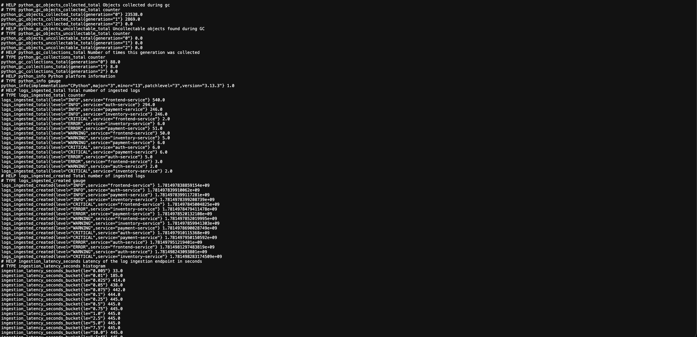
*Figure 7: Raw prometheus-client scrape output exposed at the /metrics endpoint.*

### OpenSearch Root Node Metadata Response
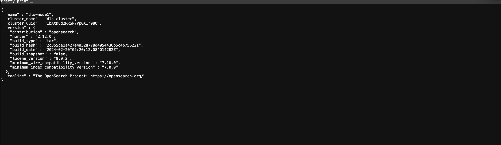
*Figure 8: OpenSearch cluster root response confirming the dls-node1 cluster state.*

### Prometheus Alertmanager Console
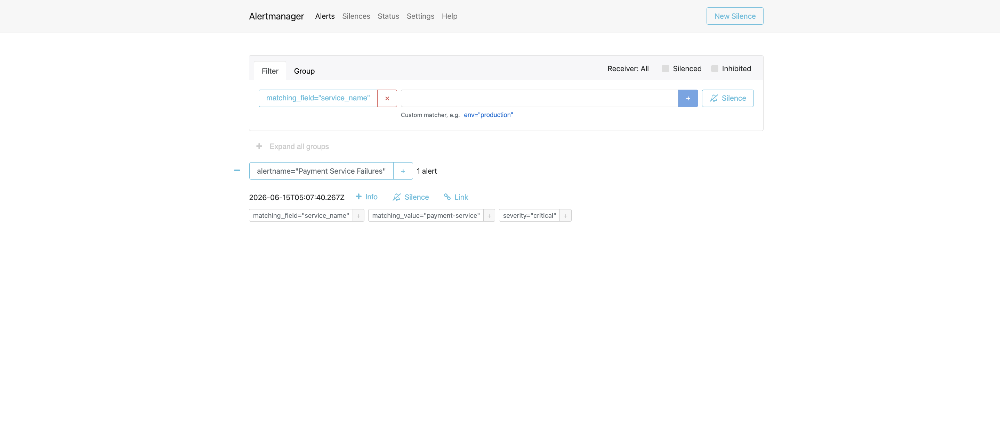
*Figure 9: Prometheus Alertmanager console displaying firing Payment Service Failures alerts.*

---

## Future Scope

1. **Horizontal Index Scaling**: Configure OpenSearch index templates to use sharding and replicas to scale index throughput.
2. **Kafka Partitioning**: Use partition keys (e.g. `service_name`) to distribute log messages across multiple Kafka brokers, scaling worker processing throughput.
3. **Advanced Log Agents**: Replace the custom Python tailing agent with FluentBit or an OpenTelemetry Collector for lower memory footprint in production environments.
4. **Log Anomaly Detection**: Implement a machine learning worker (e.g., using Isolation Forests) to detect anomaly spikes in log flows.
