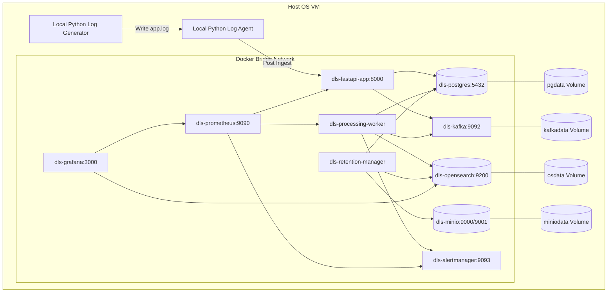

# System Deployment & Network Diagram

```mermaid
graph TD
    subgraph Host OS VM
        subgraph Docker Bridge Network
            IngestContainer[dls-fastapi-app:8000]
            WorkerContainer[dls-processing-worker]
            RetContainer[dls-retention-manager]
            
            DBContainer[(dls-postgres:5432)]
            KafkaContainer[dls-kafka:9092]
            OSContainer[(dls-opensearch:9200)]
            S3Container[(dls-minio:9000/9001)]
            
            PromContainer[dls-prometheus:9090]
            AMContainer[dls-alertmanager:9093]
            GrafContainer[dls-grafana:3000]
        end

        LocalAgent[Local Python Log Agent] -->|Post Ingest| IngestContainer
        LocalGenerator[Local Python Log Generator] -->|Write app.log| LocalAgent
        
        DBContainer --- pg_vol[(pgdata Volume)]
        KafkaContainer --- kafka_vol[(kafkadata Volume)]
        OSContainer --- os_vol[(osdata Volume)]
        S3Container --- minio_vol[(miniodata Volume)]
    end

    IngestContainer --> DBContainer
    IngestContainer --> KafkaContainer
    
    WorkerContainer --> KafkaContainer
    WorkerContainer --> DBContainer
    WorkerContainer --> OSContainer
    WorkerContainer --> AMContainer
    
    RetContainer --> OSContainer
    RetContainer --> S3Container
    RetContainer --> DBContainer
    
    PromContainer --> IngestContainer
    PromContainer --> WorkerContainer
    PromContainer --> AMContainer
    
    GrafContainer --> PromContainer
    GrafContainer --> OSContainer
```
