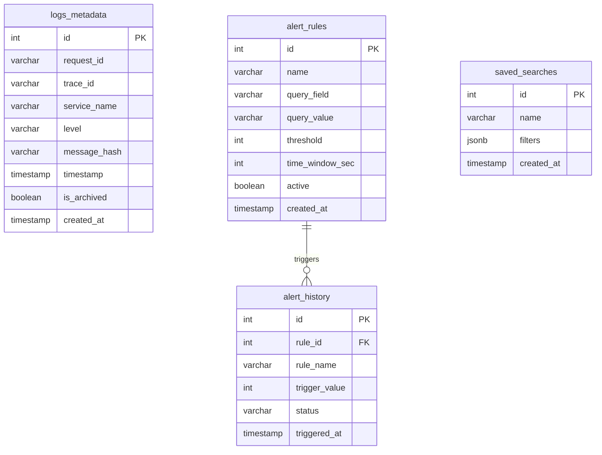

# PostgreSQL Database Entity-Relationship (ER) Schema

```mermaid
erDiagram
    logs_metadata {
        int id PK
        varchar request_id
        varchar trace_id
        varchar service_name
        varchar level
        varchar message_hash
        timestamp timestamp
        boolean is_archived
        timestamp created_at
    }

    alert_rules {
        int id PK
        varchar name
        varchar query_field
        varchar query_value
        int threshold
        int time_window_sec
        boolean active
        timestamp created_at
    }

    saved_searches {
        int id PK
        varchar name
        jsonb filters
        timestamp created_at
    }

    alert_history {
        int id PK
        int rule_id FK
        varchar rule_name
        int trigger_value
        varchar status
        timestamp triggered_at
    }

    alert_rules ||--o{ alert_history : "triggers"
```
