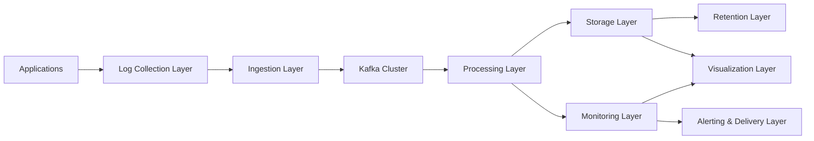

# High-Level Design (HLD) Diagram

```mermaid
graph LR
    Apps[Applications] --> Coll[Log Collection Layer]
    Coll --> Ingest[Ingestion Layer]
    Ingest --> Kafka[Kafka Cluster]
    Kafka --> Proc[Processing Layer]
    
    Proc --> Storage[Storage Layer]
    Proc --> Mon[Monitoring Layer]
    
    Storage --> Ret[Retention Layer]
    Storage --> Vis[Visualization Layer]
    
    Mon --> Vis
    Mon --> Alert[Alerting & Delivery Layer]
```
