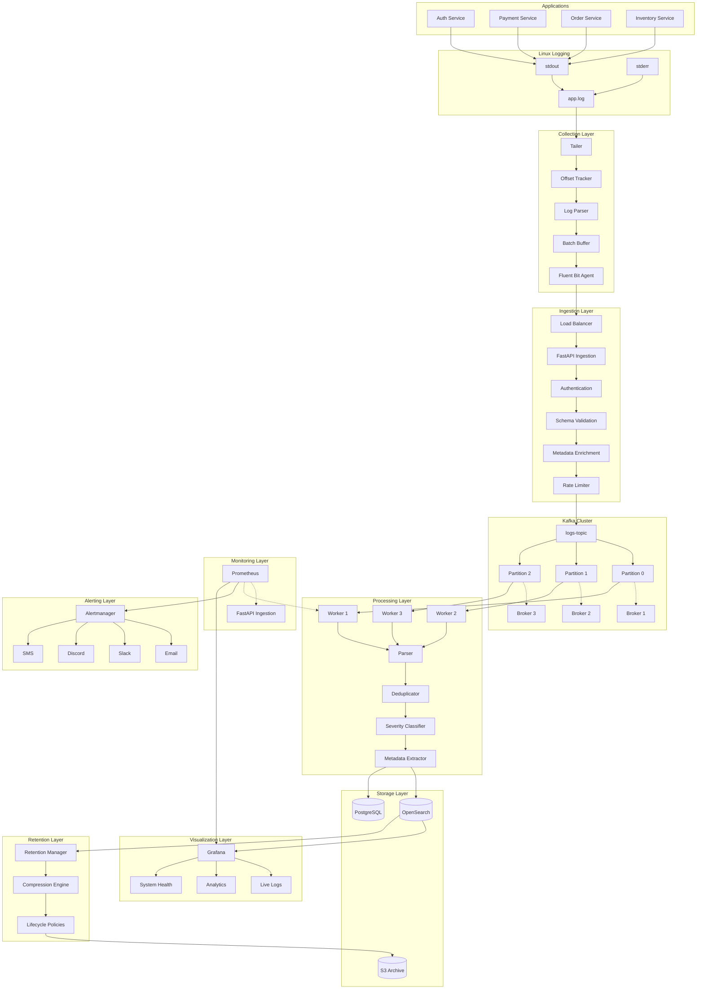

# Low-Level Design (LLD) Diagram

```mermaid
graph TD
    %% Applications & Linux Logging
    subgraph Applications
        Auth[Auth Service]
        Pay[Payment Service]
        Ord[Order Service]
        Inv[Inventory Service]
    end
    
    subgraph Linux_Logging [Linux Logging]
        Stdout[stdout]
        Stderr[stderr]
        AppLog[app.log]
        
        Auth --> Stdout
        Pay --> Stdout
        Ord --> Stdout
        Inv --> Stdout
        
        Stdout --> AppLog
        Stderr --> AppLog
    end

    %% Collection Layer
    subgraph Collection_Layer [Collection Layer]
        Tailer[Tailer]
        Offset[Offset Tracker]
        Parser[Log Parser]
        Buffer[Batch Buffer]
        FluentBit[Fluent Bit Agent]
        
        AppLog --> Tailer
        Tailer --> Offset
        Offset --> Parser
        Parser --> Buffer
        Buffer --> FluentBit
    end

    %% Ingestion Layer
    subgraph Ingestion_Layer [Ingestion Layer]
        LB[Load Balancer]
        FastAPI[FastAPI Ingestion]
        AuthN[Authentication]
        Schema[Schema Validation]
        Enrich[Metadata Enrichment]
        RateLimit[Rate Limiter]
        
        FluentBit --> LB
        LB --> FastAPI
        FastAPI --> AuthN
        AuthN --> Schema
        Schema --> Enrich
        Enrich --> RateLimit
    end

    %% Kafka Cluster
    subgraph Kafka_Cluster [Kafka Cluster]
        Topic[logs-topic]
        Broker1[Broker 1]
        Broker2[Broker 2]
        Broker3[Broker 3]
        Part0[Partition 0]
        Part1[Partition 1]
        Part2[Partition 2]
        
        RateLimit --> Topic
        Topic --> Part0
        Topic --> Part1
        Topic --> Part2
        
        Part0 -.-> Broker1
        Part1 -.-> Broker2
        Part2 -.-> Broker3
    end

    %% Processing Layer
    subgraph Processing_Layer [Processing Layer]
        Worker1[Worker 1]
        Worker2[Worker 2]
        Worker3[Worker 3]
        ProcParser[Parser]
        Dedup[Deduplicator]
        Classifier[Severity Classifier]
        MetaExtractor[Metadata Extractor]
        
        Part0 --> Worker1
        Part1 --> Worker2
        Part2 --> Worker3
        
        Worker1 --> ProcParser
        Worker2 --> ProcParser
        Worker3 --> ProcParser
        
        ProcParser --> Dedup
        Dedup --> Classifier
        Classifier --> MetaExtractor
    end

    %% Storage Layer
    subgraph Storage_Layer [Storage Layer]
        OpenSearch[(OpenSearch)]
        PostgreSQL[(PostgreSQL)]
        S3Archive[(S3 Archive)]
        
        MetaExtractor --> OpenSearch
        MetaExtractor --> PostgreSQL
    end

    %% Monitoring Layer
    subgraph Monitoring_Layer [Monitoring Layer]
        Prometheus[Prometheus]
        
        %% Prometheus scrapes metrics from Ingestion/Processing
        Prometheus -.-> IngestAPI[FastAPI Ingestion]
        Prometheus -.-> Worker1
    end

    %% Alerting Layer
    subgraph Alerting_Layer [Alerting Layer]
        AlertManager[Alertmanager]
        Email[Email]
        Slack[Slack]
        Discord[Discord]
        SMS[SMS]
        
        Prometheus --> AlertManager
        AlertManager --> Email
        AlertManager --> Slack
        AlertManager --> Discord
        AlertManager --> SMS
    end

    %% Visualization Layer
    subgraph Visualization_Layer [Visualization Layer]
        Grafana[Grafana]
        LiveLogs[Live Logs]
        Analytics[Analytics]
        SysHealth[System Health]
        
        OpenSearch --> Grafana
        Prometheus --> Grafana
        
        Grafana --> LiveLogs
        Grafana --> Analytics
        Grafana --> SysHealth
    end

    %% Retention Layer
    subgraph Retention_Layer [Retention Layer]
        RetManager[Retention Manager]
        Compression[Compression Engine]
        Policies[Lifecycle Policies]
        
        OpenSearch --> RetManager
        RetManager --> Compression
        Compression --> Policies
        Policies --> S3Archive
    end
```
