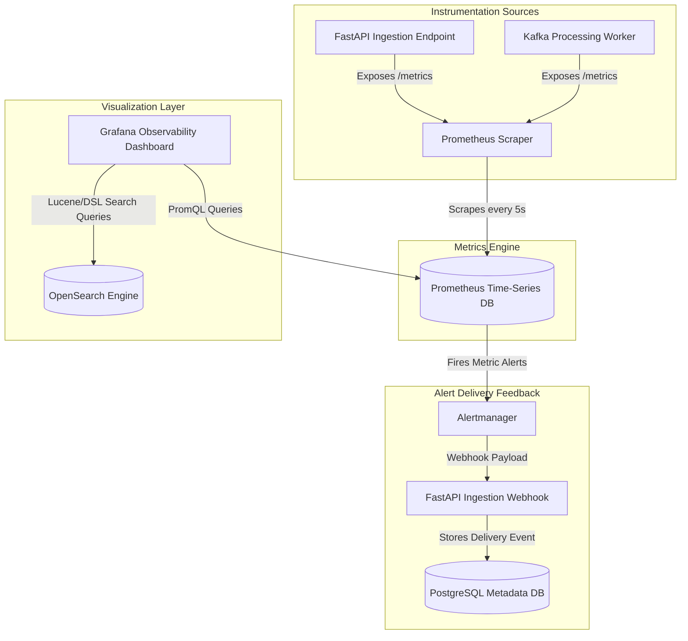

# Observability & Metrics Integration Diagram

```mermaid
graph TD
    subgraph Instrumentation Sources
        IngestAPI[FastAPI Ingestion Endpoint] -->|Exposes /metrics| PromScrape[Prometheus Scraper]
        Worker[Kafka Processing Worker] -->|Exposes /metrics| PromScrape
    end

    subgraph Metrics Engine
        PromScrape -->|Scrapes every 5s| Prometheus[(Prometheus Time-Series DB)]
    end

    subgraph Visualization Layer
        Grafana[Grafana Observability Dashboard] -->|PromQL Queries| Prometheus
        Grafana -->|Lucene/DSL Search Queries| OpenSearch[(OpenSearch Engine)]
    end

    subgraph Alert Delivery Feedback
        Prometheus -->|Fires Metric Alerts| Alertmanager[Alertmanager]
        Alertmanager -->|Webhook Payload| WebhookReceiver[FastAPI Ingestion Webhook]
        WebhookReceiver -->|Stores Delivery Event| PostgreSQL[(PostgreSQL Metadata DB)]
    end
```
