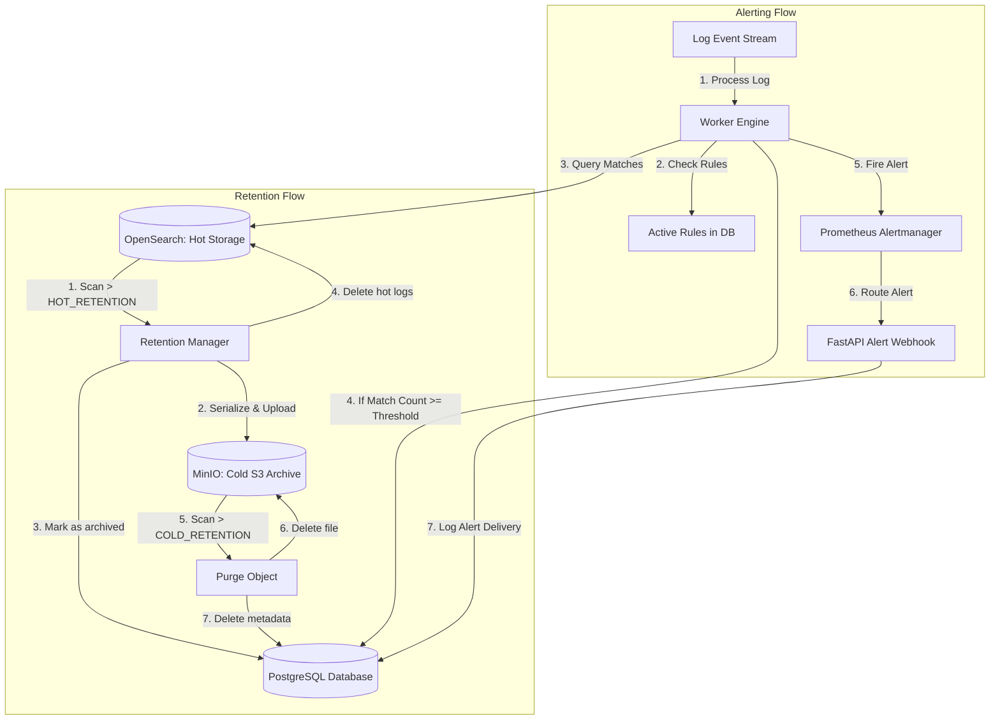

# Retention & Alerting Logical Workflow Diagram

```mermaid
graph TD
    subgraph Retention Flow
        HotOS[(OpenSearch: Hot Storage)] -->|1. Scan > HOT_RETENTION| RetManager[Retention Manager]
        RetManager -->|2. Serialize & Upload| ColdS3[(MinIO: Cold S3 Archive)]
        RetManager -->|3. Mark as archived| MetaDB[(PostgreSQL Database)]
        RetManager -->|4. Delete hot logs| HotOS
        
        ColdS3 -->|5. Scan > COLD_RETENTION| PurgeAction[Purge Object]
        PurgeAction -->|6. Delete file| ColdS3
        PurgeAction -->|7. Delete metadata| MetaDB
    end

    subgraph Alerting Flow
        LogInput[Log Event Stream] -->|1. Process Log| Worker[Worker Engine]
        Worker -->|2. Check Rules| RuleCache[Active Rules in DB]
        Worker -->|3. Query Matches| HotOS
        Worker -->|4. If Match Count >= Threshold| MetaDB
        Worker -->|5. Fire Alert| Alertmanager[Prometheus Alertmanager]
        Alertmanager -->|6. Route Alert| WebhookReceiver[FastAPI Alert Webhook]
        WebhookReceiver -->|7. Log Alert Delivery| MetaDB
    end
```
