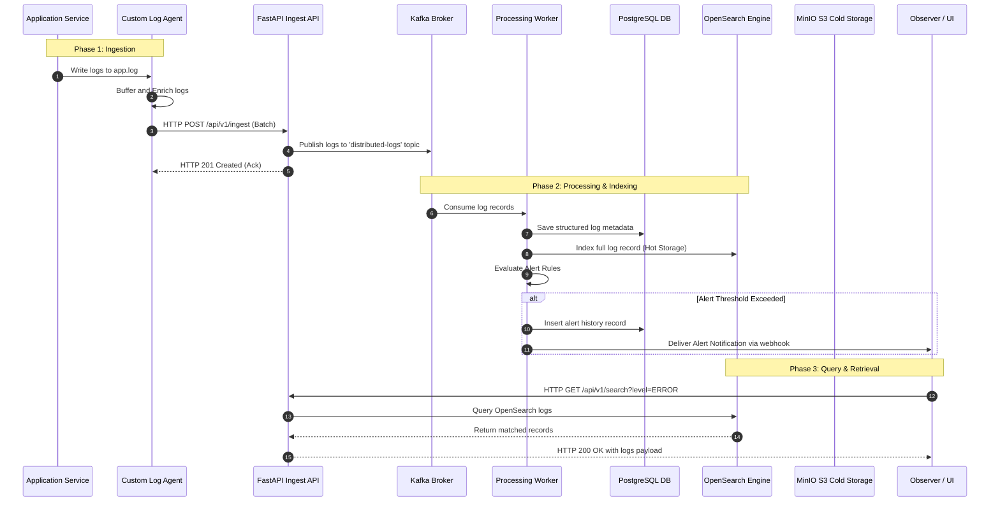

# Log Ingestion & Processing Sequence Diagram

```mermaid
sequenceDiagram
    autonumber
    participant App as Application Service
    participant Agent as Custom Log Agent
    participant Ingest as FastAPI Ingest API
    participant Kafka as Kafka Broker
    participant Worker as Processing Worker
    participant PG as PostgreSQL DB
    participant OS as OpenSearch Engine
    participant S3 as MinIO S3 Cold Storage
    participant User as Observer / UI

    Note over App, Agent: Phase 1: Ingestion
    App->>Agent: Write logs to app.log
    Agent->>Agent: Buffer and Enrich logs
    Agent->>Ingest: HTTP POST /api/v1/ingest (Batch)
    Ingest->>Kafka: Publish logs to 'distributed-logs' topic
    Ingest-->>Agent: HTTP 201 Created (Ack)

    Note over Kafka, OS: Phase 2: Processing & Indexing
    Kafka->>Worker: Consume log records
    Worker->>PG: Save structured log metadata
    Worker->>OS: Index full log record (Hot Storage)
    Worker->>Worker: Evaluate Alert Rules
    alt Alert Threshold Exceeded
        Worker->>PG: Insert alert history record
        Worker->>User: Deliver Alert Notification via webhook
    end

    Note over User, OS: Phase 3: Query & Retrieval
    User->>Ingest: HTTP GET /api/v1/search?level=ERROR
    Ingest->>OS: Query OpenSearch logs
    OS-->>Ingest: Return matched records
    Ingest-->>User: HTTP 200 OK with logs payload
```
